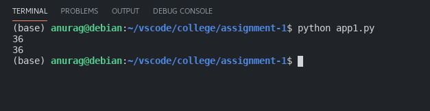
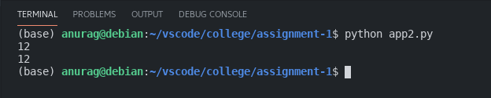
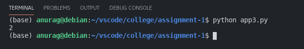
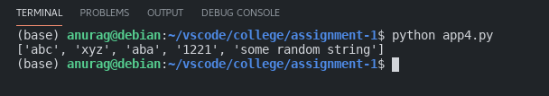
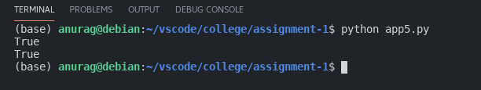
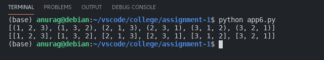
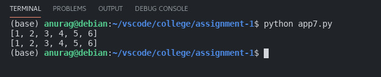
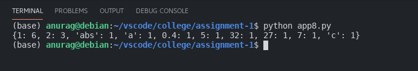
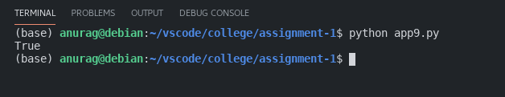
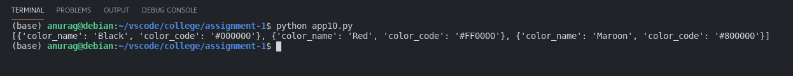

# Assignment 1 APP

### Anurag Pal

### CSB 19C4113

Q1. Write a Python program to sum all the items in a list.

Q2. Write a Python program to get the largest number from a list.

Q3.
Write a Python program to count the number of strings where
the string length is 2 or more and the first and last character are
same from a given list of strings.
sample_list = ['abc','xyz','aba','1221']

Q4. Write a Python program to remove duplicates from a list.

Q5. Write a Python function that takes two lists and returns True if
they have atleast one common member.

Q6. Write a Python program to generate all permutations of a list in
Python.

Q7. Write a Python program to flatten a multi-dimensional list.

Q8. Write a Python program to get the frequency of the elements in a
list,thereby generating a dictionary.
Sample List: [1,2,1,1,1,'abs','a',0.4,1,2,5,32,27,2,7,1,'c']
Expected Result: {1:6, 2:3, ’abs’:1, ’a’:1....}

Q9. Write a Python program to check whether a list contains a sublist.

Q10. Write a Python program to convert list to list of dictionaries.
Sample lists: ["Black","Red","Maroon","Yellow"],["#000000", "#FF0000","#800000","#FFFF00"]
Expected Output: [{'color_name':'Black','color_code':'#000000'},
{'color_name': 'Red', 'color_code': '#FF0000'}, {'color_name':
'Maroon', 'color_code': '#800000'}, {'color_name': 'Yellow',
'color_code':'#FFFF00'}

